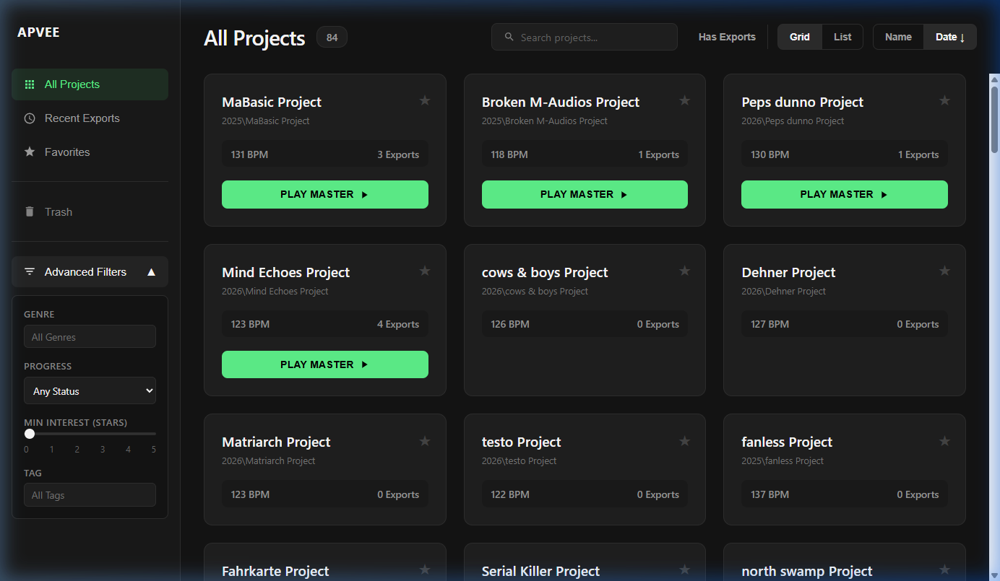
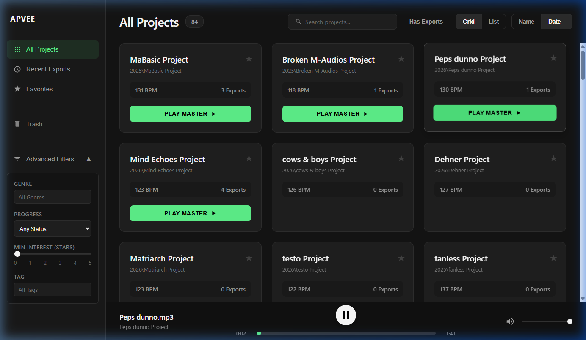
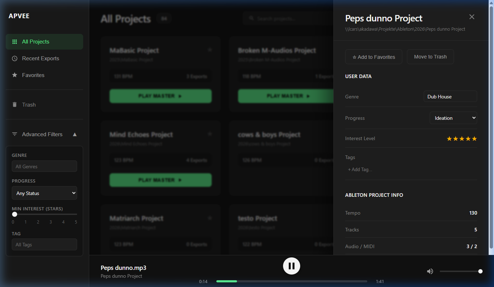

# APVee — Ableton Project Viewer

APVee is a sleek, DAW-inspired web interface for browsing, managing, and listening to your **Ableton Live projects** over a local network.

It automatically scans your project directory, reads `.als` files for metadata, and surfaces your audio exports for instant playback — all without touching Ableton.

**Advanced Filters & Project Grid**


**Audio Player Active**


**Project Detail Panel**


---

## Features

### 🎛️ Project Browser
- **Auto-scan** of a configured music directory (recursive, network share compatible)
- **Grid & List views** with sorting by Name or Date
- **Search bar** for instant project filtering
- **84+ projects** loaded in the demo above

### 🔊 Audio Playback
- **Instant playback** via a built-in custom audio player bar
- Scans `Master`, `Bounce`, and `Preview` subdirectories for audio exports (`.wav`, `.mp3`)
- Hierarchical play button: **Play Master → Play Bounce → Play Preview → No Exports**
- Per-project export history with file size and date
- Version selector in the player bar to switch between exports

### ⚠️ Asset Status Indicators
- **Missing folder warnings**: e.g. *"No Master, Bounce folders"* shown in red per project card
- **"No Exports"** label when no audio files are found in any of the expected folders

### 🗂️ Organisation
- **Favorites** — star any project, filter by favorites
- **Trash** — hide projects without deleting them
- **Recent Exports** — auto-sorted view of projects with the most recent audio

### 🏷️ User Metadata
- Tag projects with custom **Genre**, **Progress status**, **Interest level** (star rating), and **Tags**
- All metadata stored locally in `localStorage`
- **Advanced Filters** sidebar to drill down by any metadata field
- Filters and autocomplete suggestions are dynamically populated from your own data

### ⚙️ Backend
- Node.js + Express backend with background scanning on startup
- Parses Ableton `.als` (gzipped XML) files for tempo, track count, audio/MIDI split, and version
- Auto-rescans on file changes via `chokidar`
- Smart loading UX: full-screen loader only on first load, subtle *"Syncing..."* indicator for background rescans

---

## Stack

| Layer    | Technology              |
|----------|-------------------------|
| Frontend | React + Vite            |
| Styling  | Vanilla CSS (dark theme)|
| Backend  | Node.js + Express       |
| Parsing  | zlib (ALS decompression)|
| Watching | chokidar                |

---

## Setup

### Requirements
- Node.js 18+
- A directory of Ableton Live projects (local or network share)

### Backend
```bash
cd backend
npm install
MUSIC_DIR=/path/to/your/projects node server.js
# Windows:
# $env:MUSIC_DIR="\\server\share\Projekte\Ableton"; node server.js
```

### Frontend
```bash
cd frontend
npm install
npm run dev
```

Then open **http://localhost:5173**

---

## Roadmap / Open Tasks

- [ ] Fix `category` property for exports from `Master`/`Bounce`/`Preview` folders to ensure correct "Play Master / Bounce / Preview" button labels
- [ ] Add a `README` section for Docker-based deployment
- [ ] Implement keyboard shortcuts for playback (Space = play/pause)
- [ ] Add waveform visualization in the player bar
- [ ] Export project list as CSV / JSON
- [ ] Support for additional audio formats (`.aiff`, `.flac`)
- [ ] Mobile-responsive layout
- [ ] Multi-user support with server-side metadata storage (replace `localStorage`)
